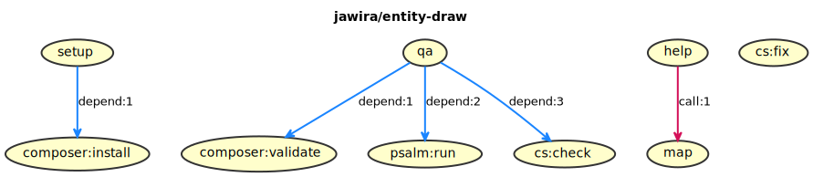

# jawira/entity-draw

**This library generates class diagrams from your Doctrine ORM entities.<br>
It is designed for use with [jawira/doctrine-diagram-bundle](https://packagist.org/packages/jawira/doctrine-diagram-bundle).**

[][packagist]
[][packagist]
[][packagist]
[][packagist]

## Install

```console
composer require jawira/entity-draw
```

## Contributing

- If you liked this project, ⭐ star it on GitHub.
- Or follow me on 𝕏.
  [](https://x.com/jawira)
- Found a bug? Please report it by opening an issue!

## Phing



## License

This library is licensed under the [MIT license](LICENSE.md).


***

## Packages from jawira

<dl>

<dt>
    <a href="https://packagist.org/packages/jawira/doctrine-diagram-bundle">jawira/doctrine-diagram-bundle
    </a>
</dt>
<dd>Symfony Bundle to generate database diagrams.</dd>

<dt>
    <a href="https://packagist.org/packages/jawira/plantuml">jawira/plantuml
    </a>
</dt>
<dd>Provides PlantUML executable and plantuml.jar</dd>


<dt><a href="https://packagist.org/packages/jawira/">more...</a></dt>
</dl>


[packagist]: <https://packagist.org/packages/jawira/entity-draw>
